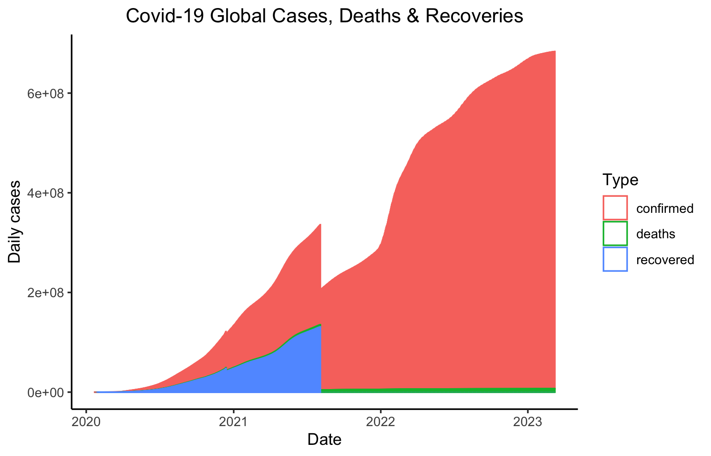
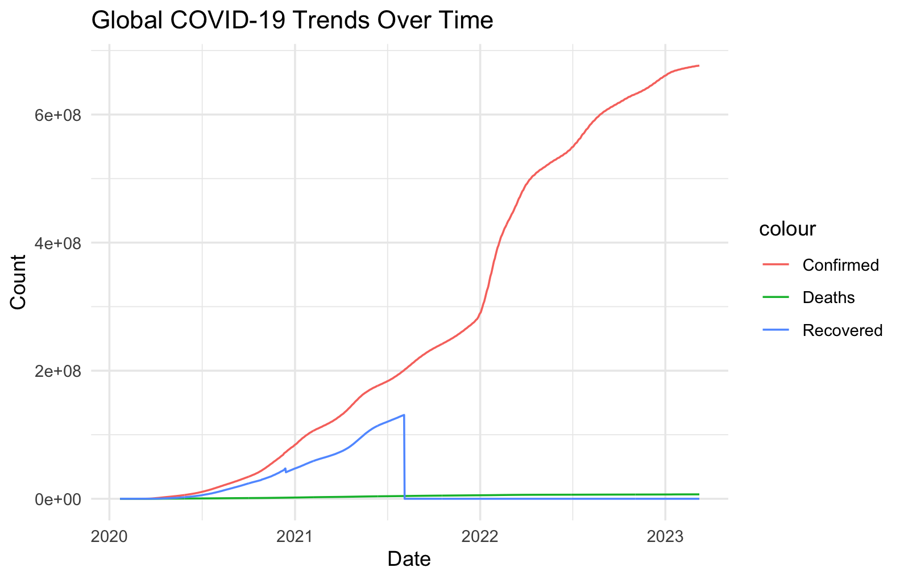
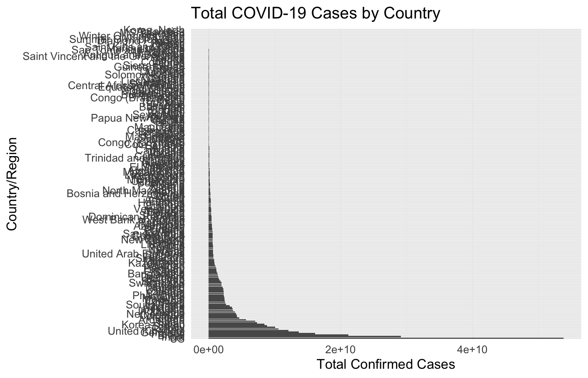
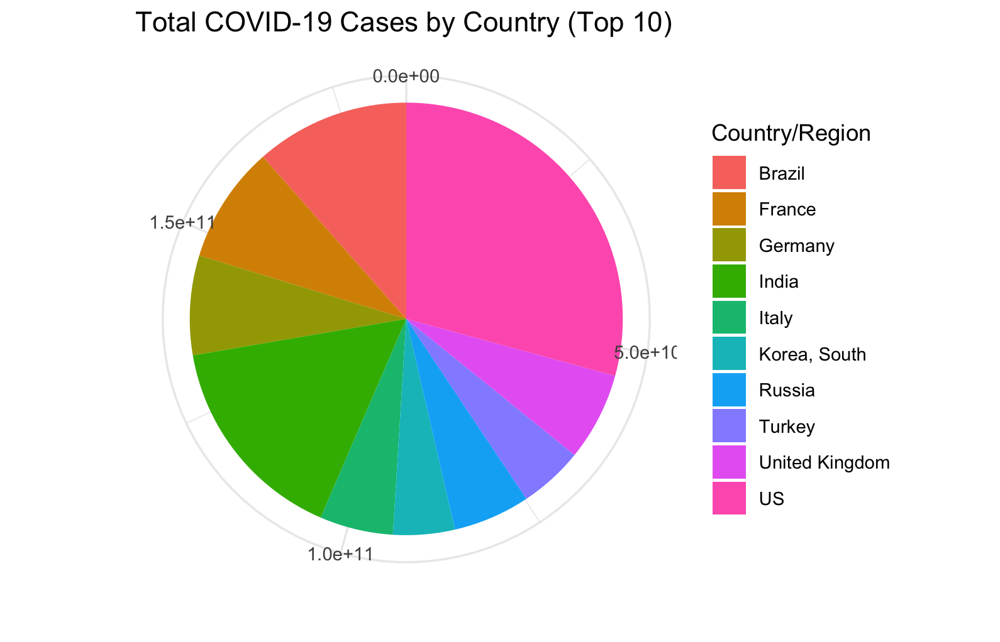
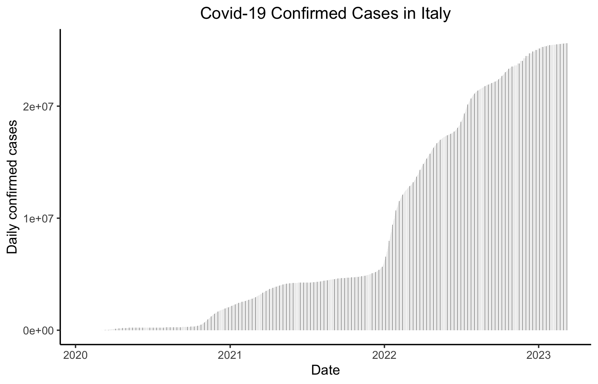
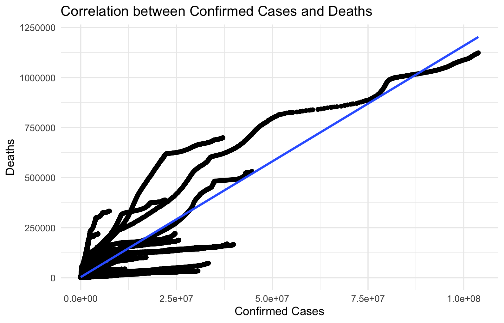
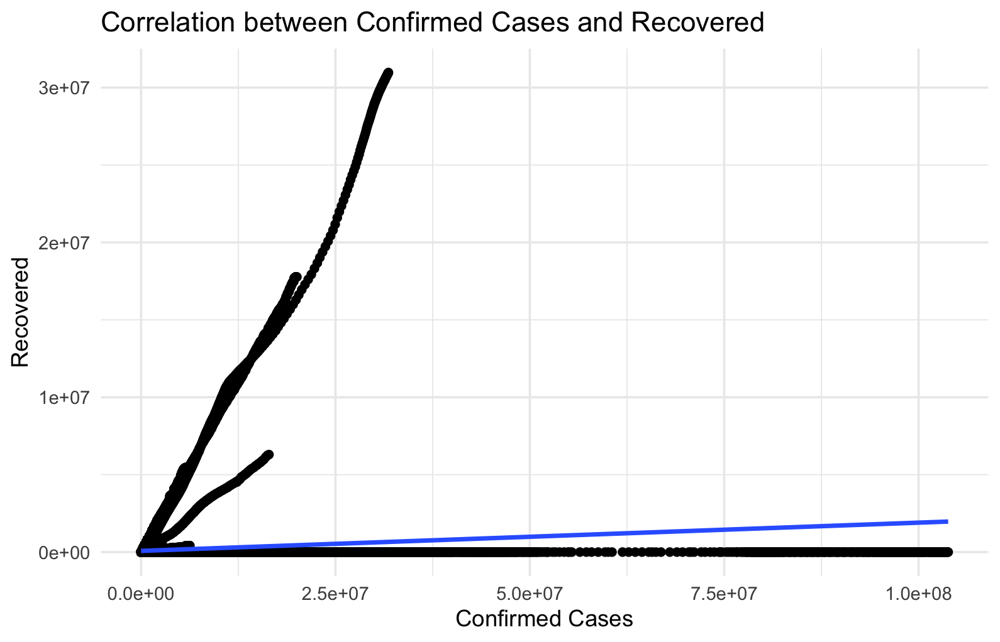

## Question
### [Link for datasets](https://data.world/shad/covid-19-time-series-data)

#### 1. Data Import and Exploration

```r
# Load required libraries
library(dplyr)
library(tidyr)
library(readr)
library(ggplot2)
library(tsibble)

# Instruction 1 Data Import and Exploration

# Import the datasets
confirmedraw <- read_csv("~/Downloads/covid19_ts_gh/confirmed_global.csv")
deathsraw <- read_csv("~/Downloads/covid19_ts_gh/deaths_global.csv")
recoveredraw <- read_csv("~/Downloads/covid19_ts_gh/recovered_global.csv")

# Display the structure and summary statistics
str(confirmedraw)
str(deathsraw)
str(recoveredraw)

summary(confirmedraw)
summary(deathsraw)
summary(recoveredraw)

# Check for missing values
sum(is.na(confirmedraw))
sum(is.na(deathsraw))
sum(is.na(recoveredraw))

# Convert datasets to long format

confirmed <- confirmedraw %>% gather(key="date", value="confirmed", -c(`Country/Region`, `Province/State`, Lat, Long)) %>% group_by(`Country/Region`, date) %>% summarize(confirmed=sum(confirmed)) %>% ungroup()
deaths <- deathsraw %>% gather(key="date", value="deaths", -c(`Country/Region`, `Province/State`, Lat, Long)) %>% group_by(`Country/Region`, date) %>% summarize(deaths=sum(deaths)) %>% ungroup()
recovered <- recoveredraw %>% gather(key="date", value="recovered", -c(`Country/Region`, `Province/State`, Lat, Long)) %>% group_by(`Country/Region`, date) %>% summarize(recovered=sum(recovered)) %>% ungroup()

# Final data: combine all 3 datasets
country <- full_join(confirmed, deaths) %>% full_join(recovered)

str(country)

# Convert the `date` column to Date format
country <- country %>%
  mutate(date = as.Date(date, format = "%m/%d/%y"))

str(country)

# Create new variable: number of days
country <- country %>% group_by(`Country/Region`) %>% mutate(cumconfirmed=cumsum(confirmed), days = date - first(date) + 1) %>% ungroup()

# Aggregate at world level
world <- country %>% group_by(date) %>% summarize(confirmed=sum(confirmed), cumconfirmed=sum(cumconfirmed), deaths=sum(deaths), recovered=sum(recovered)) %>% mutate(days = date - first(date) + 1)
```
### 2. Data Visualization
```r

#__________________________________________________________________

# Instruction 2 Data Visualization:

# visualize the progression of COVID-19 cases, deaths, and recoveries over time
str(world)
world %>% select(-cumconfirmed) %>% gather("Type", "Cases", -c(date, days)) %>%
  ggplot(aes(x=date, y=Cases, colour=Type)) + geom_bar(stat="identity", width=0.2, fill="white") +
  theme_classic() +
  labs(title = "Covid-19 Global Cases, Deaths & Recoveries", x= "Date", y= "Daily cases") +
  theme(plot.title = element_text(hjust = 0.5))
```


```r
# Global trends
global_trends <- country %>%
  group_by(date) %>%
  summarise(
    Total_Confirmed = sum(confirmed, na.rm = TRUE),
    Total_Deaths = sum(deaths, na.rm = TRUE),
    Total_Recovered = sum(recovered, na.rm = TRUE)
  )

# Plot global trends over time
ggplot(global_trends, aes(x = as.Date(date))) +
  geom_line(aes(y = Total_Confirmed, color = "Confirmed")) +
  geom_line(aes(y = Total_Deaths, color = "Deaths")) +
  geom_line(aes(y = Total_Recovered, color = "Recovered")) +
  labs(title = "Global COVID-19 Trends Over Time", x = "Date", y = "Count") +
  theme_minimal()
```


```r

# Total cases by country
country_totals <- country %>%
  group_by(`Country/Region`) %>%
  summarise(
    Total_Confirmed = sum(confirmed, na.rm = TRUE),
    Total_Deaths = sum(deaths, na.rm = TRUE),
    Total_Recovered = sum(recovered, na.rm = TRUE)
  )

# Bar plot for total confirmed cases by country
ggplot(country_totals, aes(x = reorder(`Country/Region`, -Total_Confirmed), y = Total_Confirmed)) +
  geom_bar(stat = "identity") +
  coord_flip() +
  labs(title = "Total COVID-19 Cases by Country", x = "Country/Region", y = "Total Confirmed Cases") +
  theme_minimal()

```

```r
# Pie chart for total confirmed cases by top 10 country
top_countries <- country_totals %>%
  top_n(10, Total_Confirmed)

# Verify the top_countries
head(top_countries)

ggplot(top_countries, aes(x = "", y = Total_Confirmed, fill = `Country/Region`)) +
  geom_bar(stat = "identity", width = 1) +
  coord_polar(theta = "y") +
  labs(title = "Total COVID-19 Cases by Country (Top 10)", x = "", y = "") +
  theme_minimal()
```


```r
# Extract specific country: Italy 
italy <- country %>% filter(`Country/Region`=="Italy")

# Barchart of confirmed cases over time - Italy
ggplot(italy, aes(x=date, y=confirmed)) + geom_bar(stat="identity", width=0.1) +
  theme_classic() +
  labs(title = "Covid-19 Confirmed Cases in Italy", x= "Date", y= "Daily confirmed cases") +
  theme(plot.title = element_text(hjust = 0.5))

#__________________________________________________________________
```


### 3. Time Series Analysis
```r
# Instruction 3 Time Series Analysis

# Calculate daily changes and growth rates
country <- country %>%
  group_by(`Country/Region`) %>%
  arrange(date) %>%
  mutate(
    Daily_Confirmed = confirmed - lag(confirmed, 1),
    Daily_Deaths = deaths - lag(deaths, 1),
    Daily_Recovered = recovered - lag(recovered, 1),
    Growth_Rate_Confirmed = (Daily_Confirmed / lag(confirmed, 1)) * 100,
    Growth_Rate_Deaths = (Daily_Deaths / lag(deaths, 1)) * 100,
    Growth_Rate_Recovered = (Daily_Recovered / lag(recovered, 1)) * 100
  ) %>%
  ungroup()

# View the first few rows to ensure calculations are correct
head(country)

# Identify regions with significant increases or decreases
significant_changes <- country %>%
  group_by(`Country/Region`) %>%
  summarise(
    Avg_Daily_Confirmed = mean(Daily_Confirmed, na.rm = TRUE),
    Avg_Growth_Rate_Confirmed = mean(Growth_Rate_Confirmed, na.rm = TRUE),
    Total_Confirmed = sum(confirmed, na.rm = TRUE)
  ) %>%
  arrange(desc(Avg_Daily_Confirmed))

# View the top regions with significant changes
head(significant_changes, 10)

# Load necessary libraries
library(ggpubr)
library(ggplot2)

# Plot correlation between confirmed cases and deaths
ggplot(country, aes(x = confirmed, y = deaths)) +
  geom_point() +
  geom_smooth(method = "lm", se = TRUE) +
  labs(title = "Correlation between Confirmed Cases and Deaths", x = "Confirmed Cases", y = "Deaths") +
  theme_minimal()
```

#### Interpretation: 
```r
# Plot correlation between confirmed cases and recovered
ggplot(country, aes(x = confirmed, y = recovered)) +
  geom_point() +
  geom_smooth(method = "lm", se = TRUE) +
  labs(title = "Correlation between Confirmed Cases and Recovered", x = "Confirmed Cases", y = "Recovered") +
  theme_minimal()

#__________________________________________________________________
```

#### Interpretation: